# io-homecontrol Protocol Reference

Complete technical reference for the **io-homecontrol** wireless protocol used by
Somfy and other European shutter/blind manufacturers.

> **Source of truth:** This document is based on the
> [iown-home](https://github.com/rspaargaren/iown-home) reverse-engineering project.

---

## Table of Contents

1. [Physical Layer (Radio)](#1-physical-layer-radio)
2. [Wire Encoding (UART)](#2-wire-encoding-uart)
3. [Data Link Layer (Frame Structure)](#3-data-link-layer-frame-structure)
4. [Application Layer (Commands)](#4-application-layer-commands)
5. [Security & Cryptography](#5-security--cryptography)
6. [Sequence Numbers & Replay Protection](#6-sequence-numbers--replay-protection)
7. [ACK / NACK Mechanism](#7-ack--nack-mechanism)
8. [Pairing Protocol](#8-pairing-protocol)
9. [Normal Operation](#9-normal-operation)
10. [Device Types](#10-device-types)
11. [Address Reference](#11-address-reference)

---

## 1. Physical Layer (Radio)

### Standard

IEEE 802.15.4(g) / ETSI EN 300-220, **868 MHz ISM band** (Europe).

### Modulation Parameters

| Parameter       | Value                  |
|-----------------|------------------------|
| Modulation      | 2-FSK (NRZ, LSB first) |
| Data rate       | 38 400 bps             |
| Frequency dev.  | ±19.2 kHz              |
| Encoding        | NRZ (Non-Return-to-Zero) |
| Bit order       | LSB first per byte     |

### Frequency Channels

| Channel | Center Freq  | Range               | Used by     |
|---------|-------------|---------------------|-------------|
| **CH1** | 868.25 MHz  | 868.0 – 868.6 MHz   | 2W only     |
| **CH2** | 868.95 MHz  | 868.7 – 869.2 MHz   | **1W + 2W** |
| **CH3** | 869.85 MHz  | 869.7 – 870.0 MHz   | 2W only     |

Normal operation uses **CH2** exclusively. Pairing sniffer mode scans all three
channels in round-robin (50 ms dwell per channel).

### CC1101 Radio Configuration

The CC1101 is used in **asynchronous serial mode** (PKT_FORMAT = 3). The GDO0
pin outputs/inputs a continuous UART data stream at 38 400 baud.

| CC1101 Setting     | Value                    |
|--------------------|--------------------------|
| Frequency          | 868.95 MHz (CH2)         |
| Modulation         | 2-FSK                    |
| Symbol rate        | 38 400 baud              |
| FSK deviation      | 19 200 Hz                |
| Packet format      | Async serial (PKT_FORMAT=3) |
| GDO0               | Bidirectional serial data |

> **Why CC1101?** io-homecontrol wraps each byte in UART framing (start + stop bits).
> The CC1101's async serial mode handles this transparently. Radios like SX126x/SX127x
> do not support this and cannot reliably decode io-homecontrol.

---

## 2. Wire Encoding (UART)

Every data byte on the radio is wrapped in standard UART framing:

```
  [START=0] [b0 b1 b2 b3 b4 b5 b6 b7] [STOP=1]
   1 bit         8 data bits LSB-first    1 bit
```

Total: **10 bits per byte** at 38 400 baud.

### Transmission Envelope

Every transmitted frame is preceded by a preamble for AGC lock and bit sync:

```
[0x55 × 10]  [0xFF]  [0x33]  [frame bytes...]
 preamble    sync1   sync2
```

| Part       | Bytes          | Purpose                         |
|------------|----------------|---------------------------------|
| Preamble   | `0x55 × 10`   | Alternating bits for AGC + sync |
| Sync word  | `0xFF 0x33`   | Frame delimiter                 |
| Frame      | 11 – 34 bytes | Protocol data (see §3)          |

**TX timing:** Each frame is repeated **4 times** (configurable 1–10) with
**40 ms** between repetitions.

### RX State Machine

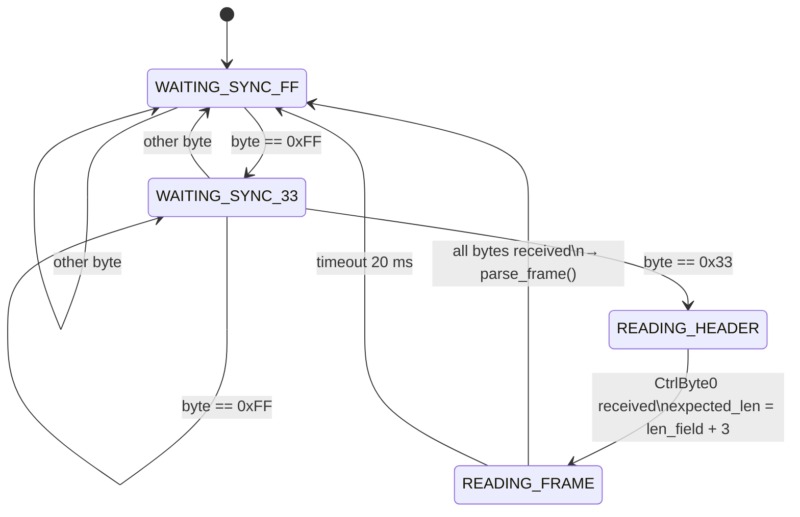

---

## 3. Data Link Layer (Frame Structure)

### Overview

```
 ┌──────────┬──────────┬───────────┬───────────┬─────┬─────────────┬──────────┬─────┐
 │CtrlByte0 │CtrlByte1 │ Target 3B │ Source 3B │ CMD │ Data (0-NB) │ Auth*    │CRC 2│
 └──────────┴──────────┴───────────┴───────────┴─────┴─────────────┴──────────┴─────┘
  byte 0      byte 1    bytes 2-4   bytes 5-7   b.8   bytes 9+      optional  last 2
```

`*` Auth = `[Seq 2B][HMAC 6B]` on 1W authenticated frames; absent on 2W and SEND_KEY.

### Size Constants

| Constant             | Value | Description                                  |
|----------------------|-------|----------------------------------------------|
| `FRAME_HEADER_SIZE`  | 9     | CB0 + CB1 + Target(3) + Source(3) + CMD      |
| `CTRL0_LEN_OVERHEAD` | 3     | CB0(1) + CRC(2) — excluded from length field |
| `MIN_FRAME_SIZE`     | 11    | Header(9) + CRC(2)                           |
| `MAX_FRAME_LEN`      | 31    | Max value in CB0 length field (5 bits)       |
| `MAX_PACKET_SIZE`    | 34    | 31 + 3                                       |
| `HMAC_AUTH_SIZE`     | 8     | Seq(2) + MAC(6)                              |
| `SEND_KEY_MIN_SIZE`  | 31    | Minimum size of SEND_KEY frame               |

### CtrlByte0 (byte 0)

```
  Bit:  7   6   5   4   3   2   1   0
       ┌───┬───┬───┬───┬───┬───┬───┬───┐
       │ O1│ O0│ W │ L4│ L3│ L2│ L1│ L0│
       └───┴───┴───┴───┴───┴───┴───┴───┘
         order  │   │←────── frame_len ──────→│
               1W/2W
```

| Bits | Field       | Values / Meaning                                      |
|------|-------------|-------------------------------------------------------|
| 7–6  | `order`     | Frame relationship in a sequence (see below)          |
| 5    | `2W`        | `0` = **1W** (one-way), `1` = **2W** (two-way)       |
| 4–0  | `frame_len` | `L = total_packet_bytes − 3` (excludes CB0 and CRC)  |

**Order field values:**

| Value | Meaning              |
|-------|----------------------|
| `00`  | Single command       |
| `01`  | Next in series       |
| `10`  | Next in parallel     |
| `11`  | Group end            |

> **Mask constants:** `CTRL0_2W_BIT = 0x20`, `CTRL0_LEN_MASK = 0x1F`

### CtrlByte1 (byte 1)

```
  Bit:  7   6   5   4   3   2   1   0
       ┌───┬───┬───┬───┬───┬───┬───┬───┐
       │BCN│RTE│PSM│ACK│ 0 │ 0 │ V1│ V0│
       └───┴───┴───┴───┴───┴───┴───┴───┘
```

| Bit | Name               | Meaning                                      |
|-----|--------------------|----------------------------------------------|
| 7   | `BCN` Beacon       | `1` = allow routing via repeater             |
| 6   | `RTE` Routed       | `1` = frame already been routed              |
| 5   | `PSM` Power Save   | `1` = destination is in low-power mode       |
| 4   | `ACK`              | `1` = device is ACK-capable (2W)             |
| 3–2 | Reserved           | `00`                                         |
| 1–0 | `V` Protocol ver  | Protocol version (0–3)                       |

> **Mask constant:** `CTRL1_BEACON_BIT = 0x80`, `CTRL1_ACK_BIT = 0x10`

### Address Fields

Each address is **3 bytes, big-endian** (MSB first).

- **Bytes 2–4:** Target address (recipient)
- **Bytes 5–7:** Source address (sender)

### CRC

- Algorithm: **CRC-16/KERMIT**
- Polynomial: `0x8408` (reflected CRC-16/CCITT)
- Initial value: `0x0000`
- Final XOR: none
- Coverage: all bytes from CtrlByte0 up to (but not including) the two CRC bytes
- Byte order in frame: **LSB first** (little-endian)

### Frame Layout Diagrams

#### Standard 1W Authenticated Frame (e.g., EXECUTE)

```
Offset  0    1    2    3    4    5    6    7    8    9   10   11   12  ...  n-8  n-7  n-6  n-5  n-4  n-3  n-2  n-1
       ┌────┬────┬────────────────┬────────────────┬────┬────────────────────┬────┬────────────────────┬────┬────┐
       │CB0 │CB1 │  Source (3 B)  │  Target (3 B)  │CMD │      Data          │    Seq (2 B)           │MAC (6 B) │CRC │CRC │
       └────┴────┴────────────────┴────────────────┴────┴────────────────────┴────┴────────────────────┴────┴────┘
```

#### SEND_KEY Frame (CMD 0x30) — No HMAC

```
Offset  0    1    2..4  5..7   8     9..24    25     26     27..28  29..30
       ┌────┬────┬──────┬──────┬─────┬────────┬──────┬──────┬───────┬───────┐
       │CB0 │CB1 │ Tgt  │ Src  │0x30 │EncKey  │ManID │ 0x01 │  Seq  │  CRC  │
       │    │    │(3 B) │(3 B) │     │(16 B)  │0x02  │      │(2 B)  │(2 B)  │
       └────┴────┴──────┴──────┴─────┴────────┴──────┴──────┴───────┴───────┘
         31 bytes total
```

#### PAIR_1W / REMOVE_CTRL Frame (CMD 0x2E / 0x39)

```
Offset  0    1    2..4  5..7   8     9     10..11  12..17  18..19
       ┌────┬────┬──────┬──────┬─────┬─────┬───────┬───────┬───────┐
       │CB0 │CB1 │ Src  │ Tgt  │CMD  │0x00 │  Seq  │  MAC  │  CRC  │
       │    │    │(3 B) │(3 B) │     │     │(2 B)  │(6 B)  │(2 B)  │
       └────┴────┴──────┴──────┴─────┴─────┴───────┴───────┴───────┘
         20 bytes total
```

---

## 4. Application Layer (Commands)

The **CMD** byte is at frame offset 8.

### Complete Command Table

| Value  | Name               | Direction              | Description                                  |
|--------|--------------------|------------------------|----------------------------------------------|
| `0x00` | `EXECUTE`          | Controller → Actuator  | Move to position / open / close / stop       |
| `0x01` | `ACTIVATE_MODE`    | Controller → Actuator  | Activate a named mode                        |
| `0x03` | `PRIVATE_CMD`      | —                      | Vendor-private command                       |
| `0x04` | `PRIVATE_ANS`      | —                      | Vendor-private answer                        |
| `0x20` | `WRITE_PRIVATE`    | —                      | Write vendor-private data                    |
| `0x21` | `PRIVATE_ACK`      | —                      | Vendor-private acknowledge                   |
| `0x28` | `DISCOVER`         | Controller → Device    | Discovery request                            |
| `0x29` | `DISCOVER_ANS`     | Device → Controller    | Discovery answer                             |
| `0x2A` | `DISCOVER` (spec.) | Controller → Device    | Specialized discovery request                |
| `0x2B` | `DISCOVER_ANS` (s.)| Device → Controller    | Specialized discovery answer                 |
| `0x2C` | `DISCOVER_CONFIRM` | Controller → Device    | Confirm discovery                            |
| `0x2D` | `DISCOVER_CONF_ACK`| Device → Controller    | Discovery confirm ACK                        |
| `0x2E` | `PAIR_1W`          | Controller → Actuator  | 1W pairing confirmation (HMAC authenticated) |
| `0x30` | `SEND_KEY`         | Controller → Actuator  | Transmit encrypted private key               |
| `0x31` | `ASK_CHALLENGE`    | Controller → Device    | Request 2W challenge (push mode)             |
| `0x32` | `KEY_TRANSFER`     | Controller → Device    | Transfer stack key (2W, encrypted)           |
| `0x33` | `KEY_TRANSFER_ACK` | Device → Controller    | Key transfer confirmation                    |
| `0x34` | `LAUNCH_KEY_XFER`  | —                      | Launch key transfer                          |
| `0x36` | —                  | —                      | 2W verification step                         |
| `0x37` | —                  | —                      | 2W verification answer                       |
| `0x38` | —                  | —                      | 2W pull-mode challenge                       |
| `0x39` | `REMOVE_CTRL`      | Controller → Actuator  | Remove controller from motor                 |
| `0x3C` | `CHALLENGE_REQ`    | Device → Controller    | Challenge request (2W auth)                  |
| `0x3D` | `CHALLENGE_ANS`    | Controller → Device    | Challenge answer (2W auth)                   |
| `0x50` | `GET_NAME`         | Controller → Device    | Request device name                          |
| `0x51` | `GET_NAME_ANS`     | Device → Controller    | Device name response                         |

### EXECUTE (0x00) Payload

```
Offset  9     10    11   12    13    14
       ┌──────┬──────┬─────────────┬──────┬──────┐
       │ Orig │ ACEI │  MainParam  │  FP1 │  FP2 │
       │ 0x01 │ 0x00 │   2 bytes   │      │      │
       └──────┴──────┴─────────────┴──────┴──────┘
```

| Field        | Bytes | Value  | Meaning         |
|--------------|-------|--------|-----------------|
| `Originator` | 1     | `0x01` | User-initiated  |
| `ACEI`       | 1     | `0x00` | Default         |
| `MainParam`  | 2     | various| Movement target |
| `FP1`        | 1     | `0x00` | Functional parameter 1 |
| `FP2`        | 1     | `0x00` | Functional parameter 2 |

#### MainParam Values

| Value    | Constant  | Meaning                                 |
|----------|-----------|------------------------------------------|
| `0x0000` | `OPEN`    | Fully open (UP)                          |
| `0x0001`–`0xC7FF` | — | Intermediate position (see formula below) |
| `0xC800` | `CLOSE`   | Fully closed (DOWN)                      |
| `0xD200` | `STOP`    | Stop movement immediately                |
| `0xD300` | `MY_POS`  | Go to preset "My" position               |

**Position formula** (ESPHome ↔ protocol mapping):

```
protocol_param = (1.0 - esphome_position) × 0xC800

where:
  esphome_position: 0.0 = closed, 1.0 = open
  protocol_param:   0x0000 = open, 0xC800 = closed
```

### ACTIVATE_MODE (0x01) Payload

```
Offset  9     10    11    12    13   14
       ┌──────┬──────┬──────┬──────┬──────┬──────┐
       │ Orig │ ACEI │ Mode │ModeP │  ?   │  ?   │
       │ 0x01 │ 0x00 │      │      │      │      │
       └──────┴──────┴──────┴──────┴──────┴──────┘
```

---

## 5. Security & Cryptography

### Key Hierarchy

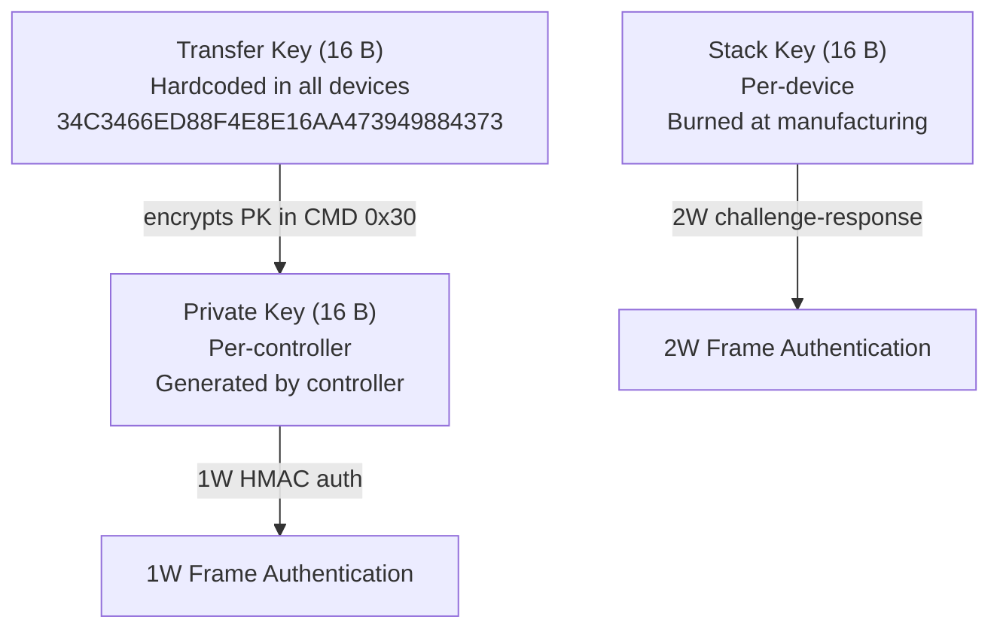

| Key              | Size   | Purpose                        | How obtained                     |
|------------------|--------|--------------------------------|----------------------------------|
| **Transfer Key** | 16 B   | Encrypts private key in pairing | Hardcoded in all devices         |
| **Private Key**  | 16 B   | 1W HMAC authentication          | Generated by controller          |
| **Stack Key**    | 16 B   | 2W challenge-response auth      | Burned at manufacturing (secret) |

**Hardcoded Transfer Key** (universally known):

```
34 C3 46 6E  D8 8F 4E 8E  16 AA 47 39  49 88 43 73
```

### Private Key Encryption (SEND_KEY / CMD 0x30)

AES-128-CFB128 for a single 16-byte block simplifies to AES-ECB XOR:

```
IV construction from source address [A, B, C]:
  IV = [A B C A B C A B C A B C A B C A]   (16 bytes cycling)

Encryption:
  keystream    = AES_ECB(Transfer_Key, IV)
  enc_key      = keystream XOR private_key

Decryption (same operation, XOR is self-inverse):
  private_key  = AES_ECB(Transfer_Key, IV) XOR enc_key
```

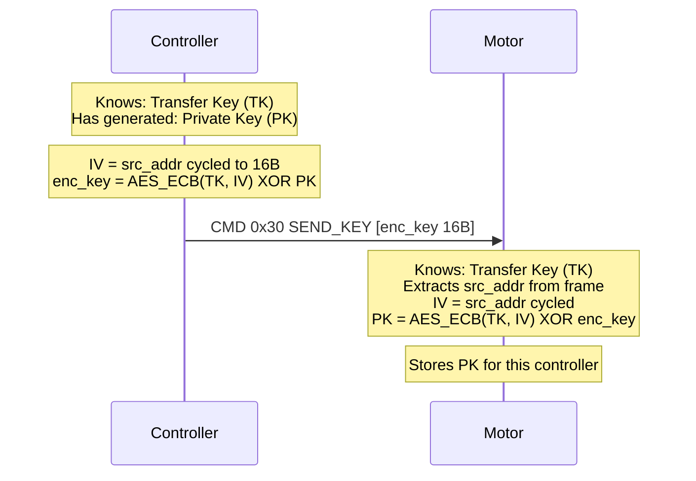

### 1W HMAC Computation

Every authenticated 1W frame (except SEND_KEY) carries a 6-byte HMAC.

#### Step 1: Build the IV (16 bytes)

```
Input data D = {cmd_byte, data_byte_0, data_byte_1, ...}

IV layout:
  ┌──────────────────────────┬──────────┬──────────┬──────────────┐
  │ D[0..7] padded with 0x55 │ chksum1  │ chksum2  │  seq (MSB)   │
  │        (8 bytes)         │ (1 byte) │ (1 byte) │  seq (LSB)   │
  │                          │          │          │  0x55 × 4    │
  └──────────────────────────┴──────────┴──────────┴──────────────┘
  bytes 0-7                   byte 8     byte 9     bytes 10-15
```

Where:
- bytes 0–7 = first 8 bytes of D, padded with `0x55` if D is shorter
- bytes 8–9 = custom checksum over all bytes of D (see algorithm below)
- bytes 10–11 = sequence number, MSB first
- bytes 12–15 = `0x55 0x55 0x55 0x55`

#### Step 2: Custom Checksum Algorithm

```c
uint8_t chksum1 = 0, chksum2 = 0;
for each byte b in D:
    tmp = b ^ chksum2;
    chksum2 = ((chksum1 & 0x7F) << 1) & 0xFF;
    if ((chksum1 & 0x80) == 0) {
        if (tmp >= 128) chksum2 |= 1;
        chksum1 = chksum2;
        chksum2 = (tmp << 1) & 0xFF;
    } else {
        if (tmp >= 128) chksum2 |= 1;
        chksum1 = chksum2 ^ 0x55;
        chksum2 = ((tmp << 1) ^ 0x5B) & 0xFF;
    }
// IV[8] = chksum1, IV[9] = chksum2
```

#### Step 3: Compute HMAC

```
encrypted = AES_128_ECB(private_key, IV)   // 16 bytes output
HMAC      = encrypted[0..5]               // first 6 bytes only
```

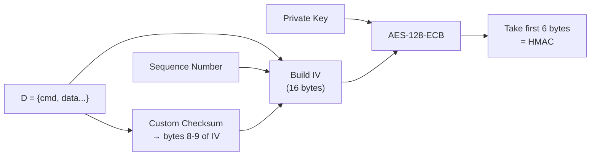

### 2W Challenge-Response

2W devices use a challenge-response protocol for authentication. The IV is
constructed the same way but bytes 10–11 hold the **challenge value** instead
of the sequence number.

---

## 6. Sequence Numbers & Replay Protection

- **Size:** 2 bytes (MSB first in frame), range 0–65535 with wrap-around
- **Scope:** Per source address — each controller has its own counter
- **Rejection rule:** Motor rejects any frame where `seq ≤ last_accepted_seq`
- **Wrap-around:** If `stored > 0xFF00` and `received < 0x0100` → accept (wrap)
- **Persistence:** Stored in ESP32 NVS flash, keyed by `fnv1_hash("iohc_seq") XOR address`
- **Auto-tracking:** Component tracks sequences for all sniffed addresses
- **TX behavior:** Increment after every transmission, persist to flash immediately

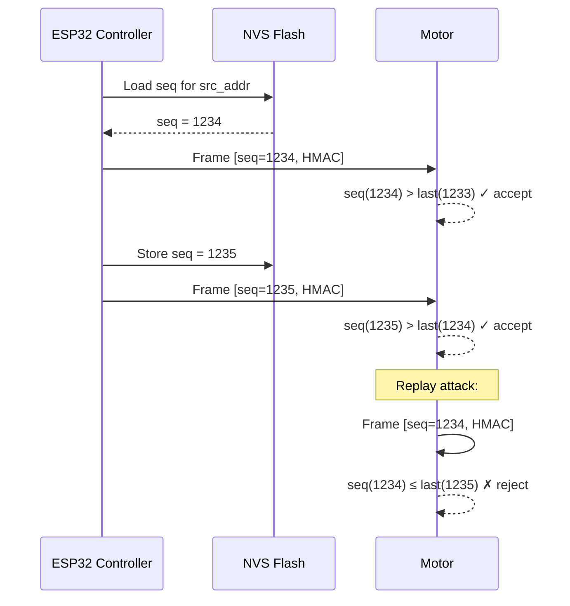

---

## 7. ACK / NACK Mechanism

| Mode | CtrlByte1 bit 4 | Behavior                                          |
|------|-----------------|---------------------------------------------------|
| **1W** | `0`           | No ACK. Reliability by frame repetition (4× default) |
| **2W** | `1`           | ACK capable. Bidirectional confirmation           |

There is no NACK — the motor simply ignores frames that fail authentication or
sequence number checks.

---

## 8. Pairing Protocol

### 1W Pairing (Controller → Motor)

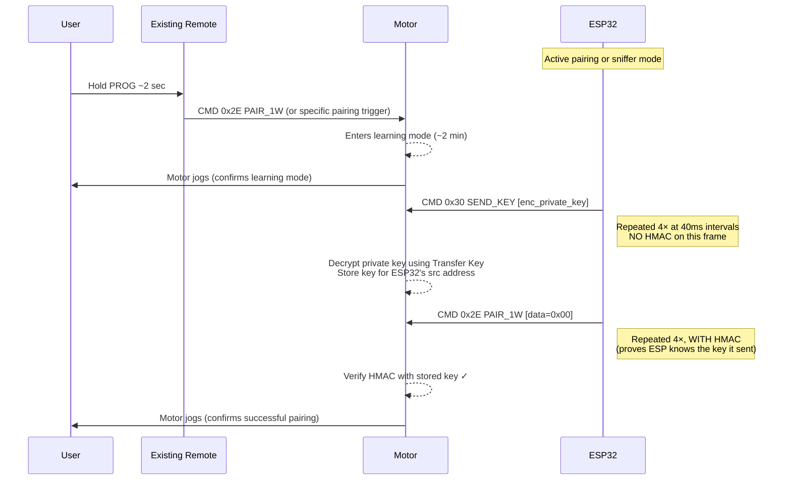

### 1W Pairing — SEND_KEY Frame (byte-level)

```
 0     1     2     3     4     5     6     7     8
┌─────┬─────┬─────┬─────┬─────┬─────┬─────┬─────┬─────┐
│0xE0 │0x00 │ TA0 │ TA1 │ TA2 │ SA0 │ SA1 │ SA2 │0x30 │
│+len │     │  Target (motor)   │  Source (controller)  │CMD  │
└─────┴─────┴─────┴─────┴─────┴─────┴─────┴─────┴─────┘
 CB0: order=3 (11), 2W=1 (0x20), len field

 9    10   11   12   13   14   15   16   17   18   19   20   21   22   23   24
┌──────────────────────────────────────────────────────────────────────────────┐
│                  Encrypted Private Key (16 bytes)                            │
└──────────────────────────────────────────────────────────────────────────────┘

25    26    27    28    29    30
┌─────┬─────┬─────┬─────┬─────┬─────┐
│0x02 │0x01 │ SH  │ SL  │ CH  │ CL  │
│ManID│Data │  Sequence (MSB first)  │  CRC (LSB first) │
└─────┴─────┴─────┴─────┴─────┴─────┘
```

`CB0 = (3 << 6) | CTRL0_2W_BIT | frame_len = 0xE0 | frame_len`

### 1W Pairing — PAIR_1W Frame (byte-level)

```
 0     1     2     3     4     5     6     7     8     9
┌─────┬─────┬─────┬─────┬─────┬─────┬─────┬─────┬─────┬─────┐
│ CB0 │0x00 │ TA0 │ TA1 │ TA2 │ SA0 │ SA1 │ SA2 │0x2E │0x00 │
└─────┴─────┴─────┴─────┴─────┴─────┴─────┴─────┴─────┴─────┘
  CB0: order=0, 1W=0, len=17

10    11    12    13    14    15    16    17    18    19
┌─────┬─────┬─────┬─────┬─────┬─────┬─────┬─────┬─────┬─────┐
│ SH  │ SL  │ M0  │ M1  │ M2  │ M3  │ M4  │ M5  │ CH  │ CL  │
│  Sequence (MSB first) │          HMAC (6 bytes)          │CRC LSB first│
└─────┴─────┴─────┴─────┴─────┴─────┴─────┴─────┴─────┴─────┘
```

### Key Capture via Sniffer

Since the Transfer Key is publicly known, any passive sniffer can extract
private keys from SEND_KEY frames:

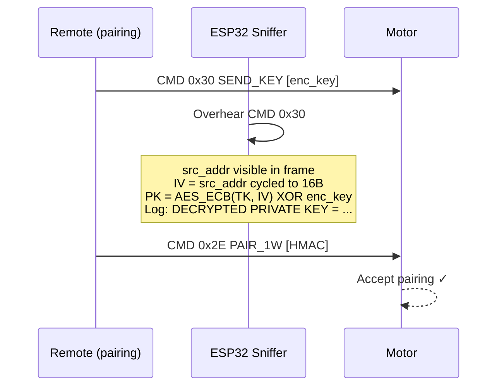

### 2W Key Exchange — Push Mode (TCM)

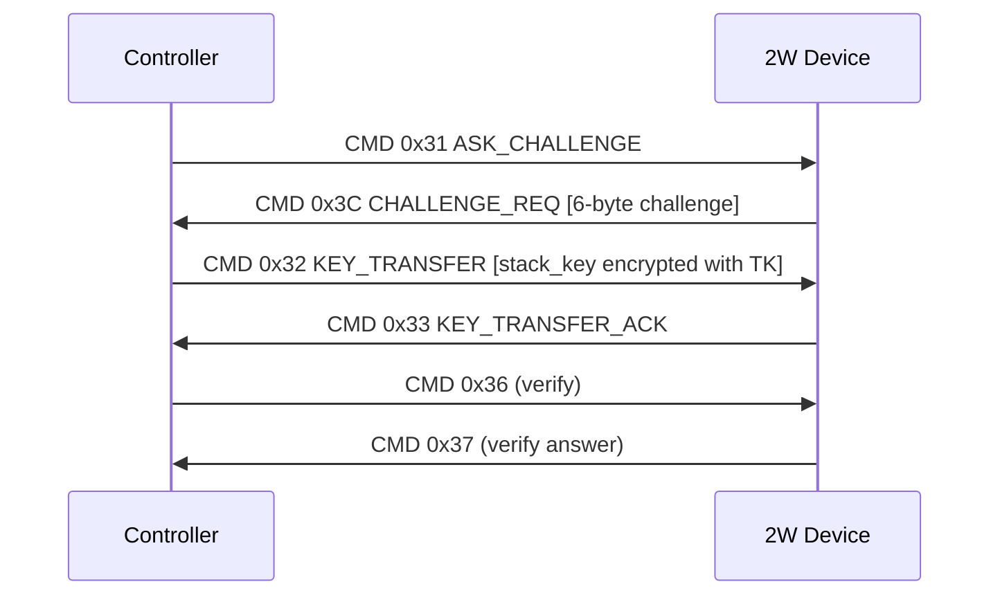

### 2W Key Exchange — Pull Mode (RCM)

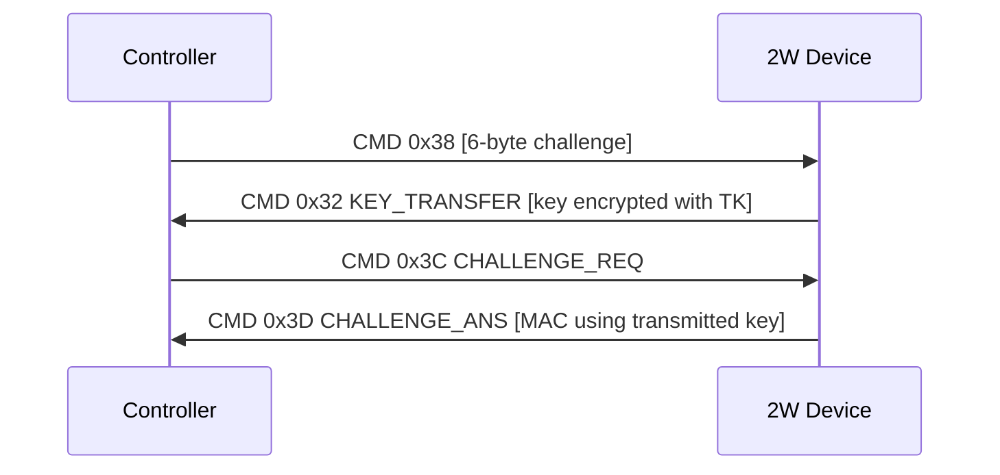

---

## 9. Normal Operation

### EXECUTE Command Flow

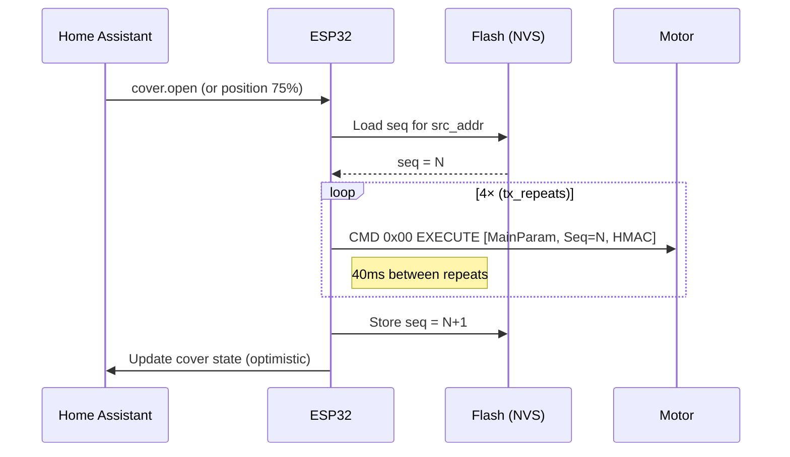

### Position Mapping

```
ESPHome       Protocol     Visual
0.0 (0%)  →  0xC800   →  ████████ CLOSED (fully down)
0.25(25%) →  0x9600   →  ██████░░
0.5 (50%) →  0x6400   →  ████░░░░
0.75(75%) →  0x3200   →  ██░░░░░░
1.0(100%) →  0x0000   →  ░░░░░░░░ OPEN   (fully up)

Formula: param = round((1.0 - position) × 0xC800)
```

---

## 10. Device Types

### Node Type Classification (3-bit field in discovery frames)

| Code | Type                       |
|------|----------------------------|
| `001`| Actuator (1W)              |
| `010`| Sensor                     |
| `011`| Video System (1W)          |
| `100`| Remote Controller          |
| `101`| Protocol Gateway (1W)      |
| `110`| Infrastructure             |
| `111`| Group (1W)                 |

### Product Type Table

| Code | Product Type                  |
|------|-------------------------------|
| 0    | Unknown                        |
| 1    | Venetian Blind                 |
| 2    | Rolling Shutter                |
| 3    | Vertical Awning                |
| 4    | Window Opener                  |
| 5    | Garage Door Opener             |
| 6    | Light                          |
| 7    | Gate Opener                    |
| 8    | Rolling Door Opener            |
| 9    | Motorized Bolt                 |
| 10   | Interior Blind                 |
| 11   | SCD                            |
| 12   | Beacon                         |
| 13   | Dual Shutter                   |
| 14   | Temperature Control Interface  |
| 15   | On/Off Switch                  |
| 16   | Horizontal Awning              |
| 17   | External Venetian Blind        |
| 18   | Louvre Blind                   |
| 19   | Curtain Track                  |
| 20   | Ventilation Point              |
| 21   | Exterior Heating               |
| 22   | Heat Pump                      |
| 23   | Intrusion Alarm                |
| 24   | Swinging Shutter               |

---

## 11. Address Reference

### Special Addresses

| Address    | Meaning                        |
|------------|--------------------------------|
| `0x00003F` | Broadcast (all devices)        |
| `0x000000` | Group address                  |
| `0xFFFFFF` | Alternate broadcast            |
| `0xFFFFFE` | P2P and broadcast sender       |
| `0xFFFDFF` | RS485 / SDN setting tool       |
| `0x00003B` | Unknown purpose                |

### Manufacturer IDs

| ID     | Manufacturer |
|--------|-------------|
| `0x02` | Somfy        |

---

## Appendix A: Full On-Wire Example (EXECUTE OPEN)

Sending "Open" from controller `0xAABBCC` to motor `0x112233`, sequence `0x1234`:

```
Preamble:  55 55 55 55 55 55 55 55 55 55
Sync:      FF 33

Frame:
  CB0:     00  → order=0, 1W (bit5=0), len = 22-3 = 19 → 0x13
                  Wait: total frame = 9(hdr) + 6(data) + 2(seq) + 6(mac) + 2(crc) = 25 bytes
                  len = 25 - 3 = 22 → 0x16
                  CB0 = 0x16
  CB1:     00
  Tgt:     11 22 33      (motor)
  Src:     AA BB CC      (controller)
  CMD:     00            (EXECUTE)
  Orig:    01            (user)
  ACEI:    00
  Param:   00 00         (OPEN)
  FP1:     00
  FP2:     00
  Seq:     12 34         (MSB first)
  HMAC:    ?? ?? ?? ?? ?? ??   (6 bytes, computed)
  CRC:     ?? ??              (CRC-16/KERMIT, LSB first)
```

---

## Appendix B: Protocol Layer Stack

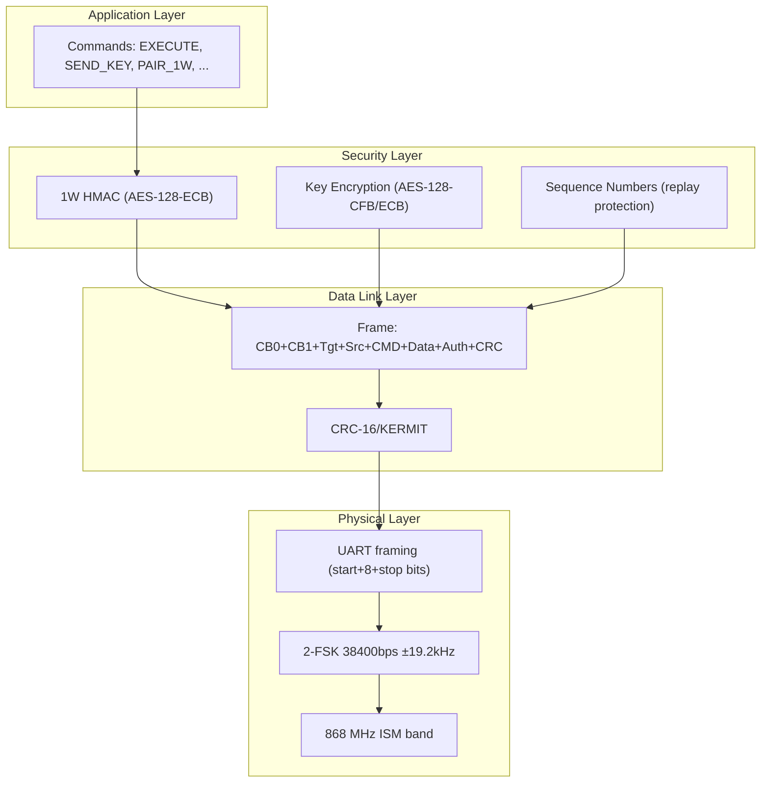

---

*Based on the [iown-home](https://github.com/rspaargaren/iown-home) reverse-engineering project.*
